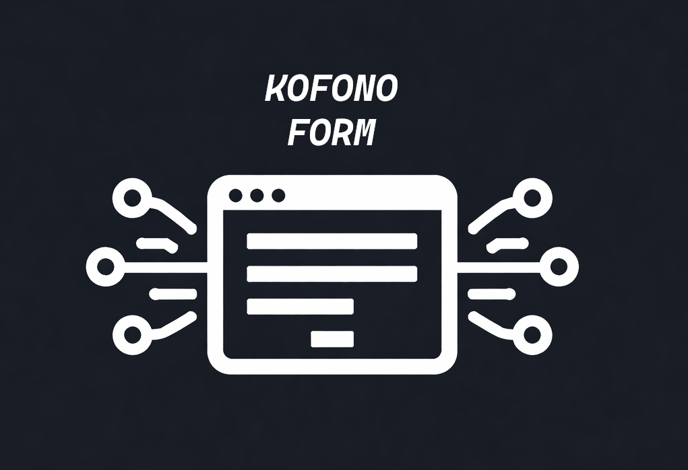

  

#### Kofono is a headless schema-based form engine that allows you to build complex forms logic with minimal effort and with a plethora of built-in features.

## Why

Most complex forms start out built directly in React/Vue/Angular/Svelte/{your_framework}. At small
scale, that's reasonable and totally manageable.

Over time, though,
this approach becomes unwieldy and hard to maintain, especially with many
inputs,
complex logic, and a growing number of forms. You end up with heavy boilerplates
and hard to maintain form components. 

You might even start extracting form logic into a separate library,
until one day you realize you've built a form engine tied to a specific UI
framework. And now you also have to write your own backend validation or introduce a schema validation library on top of it.

Kofono was built to solve this problem and decouple form logic from UI
allowing you to reuse the same schema across frontend, backend, CLI, and more.

## When to Use Kofono

- You have many complex forms with growing logic and dependencies
- You want to avoid duplicating form logic across multiple frameworks
- You need one schema that works in frontend, backend, and CLI
- You want validation and form flow that is easy to test without a UI
- You plan to build custom tooling on top of your forms

## When NOT to Use Kofono

- You only need a simple contact form
- Your app has just a few inputs and minimal logic
- A small schema or form library already covers your needs
- You do not need shared schemas across frontend and backend
